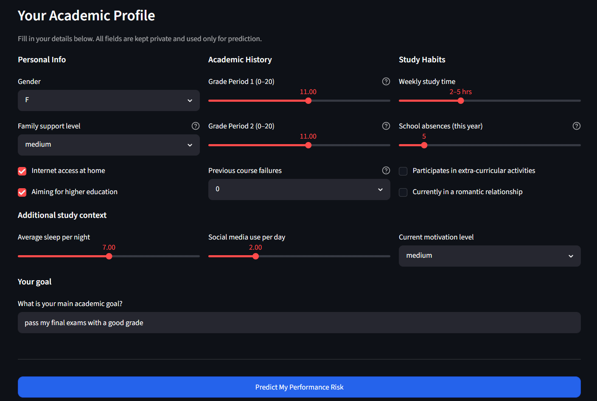
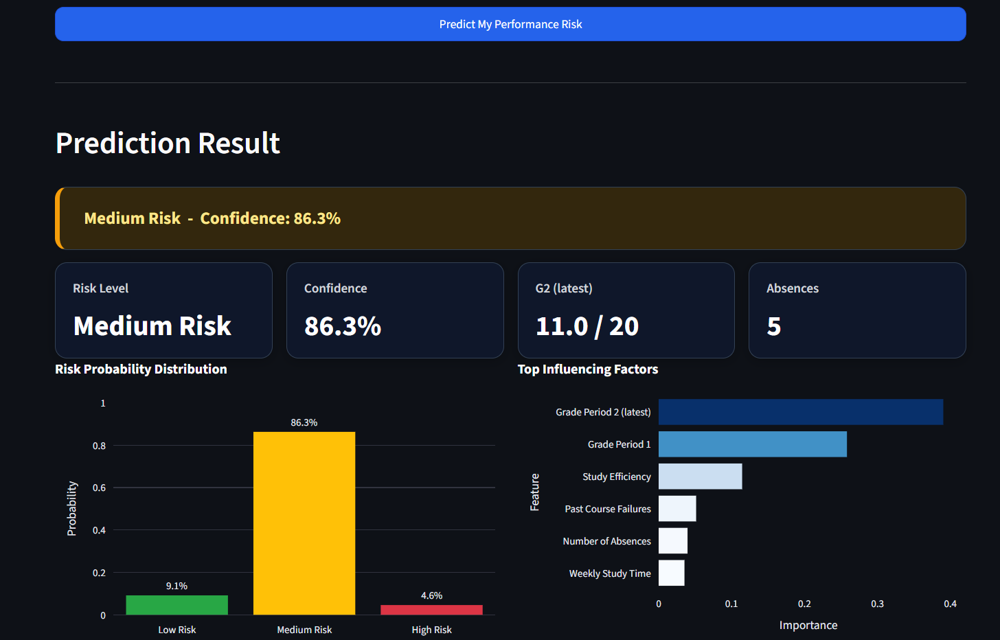
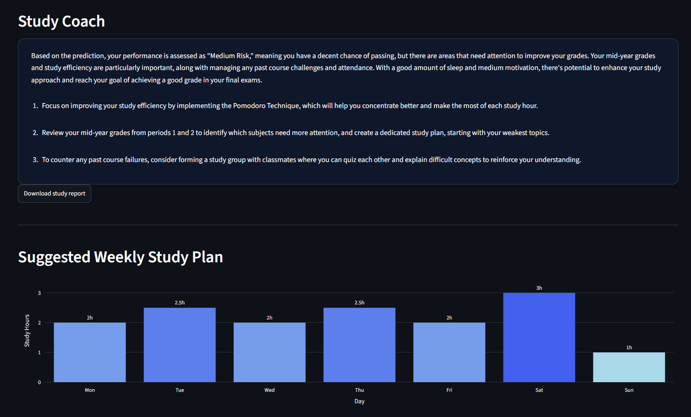

# StudySmart — Project Documentation

## Project Metadata

- Project title: StudySmart: Student Performance Prediction and Personalised Study Coaching
- Student: Katheesrupan
- GitHub repository URL: https://github.com/katheden/studysmart
- Deployment URL: https://huggingface.co/spaces/DKatheesrupan/studysmart
- Submission date: 07 June 2026

### Mandatory Setup Checks

- [x] At least 2 blocks selected
- [x] Multiple and different data sources used
- [x] Deployment URL provided
- [x] Required GitHub users added to repository (`jasminh`, `bkuehnis`)

## Selected AI Blocks

- [x] ML Numeric Data
- [x] NLP
- [ ] Computer Vision

Primary blocks used for core solution:

- Primary block 1: ML Numeric Data
- Primary block 2: NLP

---

## 1. Project Foundation (Short)

### 1.1 Problem Definition

- Problem statement:  
  Students often receive performance feedback too late to adjust their study behaviour. StudySmart estimates academic performance risk early from structured academic data and turns the result into understandable coaching advice.

- Goal:  
  Predict whether a student is in Low, Medium, or High performance risk and provide a personalised, non-judgmental study recommendation.

- Success criteria:
  - At least two ML models are trained and compared quantitatively.
  - The final model performs better than the baseline model on the held-out test set.
  - The NLP output correctly mentions the predicted risk level and important contributing factors.
  - The deployed app allows a user to enter data and receive a prediction plus study coaching.

### 1.2 Integration Logic

- How the selected blocks interact:  
  The ML block predicts the risk class and exports confidence plus top feature importances. The NLP block uses these ML outputs, together with the student's goal and the study-tips text source, to generate the final explanation and study advice.

- Data and output flow between blocks:  
  Student input → preprocessing → ML risk prediction → feature importance ranking → OpenAI/template NLP prompt → personalised study coaching output.

---

## 2. Block Documentation

Complete only selected blocks. Mark non-selected block sections as N/A.

---

## 2A. ML Numeric Data

### 2A.1 Data Source(s)

| Entry | Source name or link | Type | Size | Role in this block |
| --- | --- | --- | --- | --- |
| 1 | `student_performance.csv` | Structured CSV | 649 rows × 13 columns | Primary ML training data |
| 2 | `student_habits.csv` | Structured CSV | 1000 rows × 9 columns | EDA and behavioural context fields for coaching |
| 3 | User input from Streamlit form | Structured form input | 1 student per prediction | Inference / real-time prediction |

Dataset 1 — Student Performance features: gender, age, family support, internet access, absences, study time, past failures, higher education aspiration, extra-curricular activities, romantic relationship status, and grades G1, G2, G3.

Dataset 2 — Student Habits features: sleep hours, social media hours, daily study hours, motivation level, stress level, part-time job, learning style, exam anxiety, and mental load. It is used for EDA and to define additional behavioural fields in the app, such as sleep, social media use, and motivation. These fields personalise the coaching text but are not used by the final ML classifier.

The two structured datasets do not share a common student ID. Therefore, they were not merged row-by-row, because this would create artificial relationships between unrelated students. Instead, the Student Habits dataset is used for behavioural EDA and to design additional study-context fields in the app.

### 2A.2 Preprocessing and Features

- Cleaning steps:
  - Missing values were checked.
  - No missing values were present in the final training data.
  - Median imputation is applied defensively in the preprocessing pipeline.

- Preprocessing steps:
  - `family_support` was encoded as an ordinal integer (`none=0`, `low=1`, `medium=2`, `high=3`).
  - `gender` was encoded as a binary integer (`F=1`, `M=0`).
  - `StandardScaler` was applied to all 13 numeric features.
  - An 80/20 train/test split was used, stratified by risk class with `random_state=42`.

- Feature engineering and selection:
  - `study_efficiency = average(G1, G2) / (study_time + 0.5)`.
  - `high_absence = 1 if absences > 10 else 0`.
  - The final feature set contains 13 features: `study_time`, `absences`, `failures`, `G1`, `G2`, `internet`, `higher_edu`, `activities`, `romantic`, `family_support_num`, `gender_bin`, `high_absence`, `study_efficiency`.
  - `G3` is only used to create the target class and is not used as an input feature, to avoid target leakage.

### 2A.3 Model Selection

- Models tested:
  - Logistic Regression
  - Random Forest
  - Gradient Boosting

- Why these models were chosen:
  - Logistic Regression was used as a simple, interpretable baseline.
  - Random Forest was chosen because it handles non-linear relationships in tabular data and provides feature importance.
  - Gradient Boosting was included as a stronger ensemble comparison.

| Model | Rationale |
| --- | --- |
| Logistic Regression | Simple, interpretable baseline; assumes linear decision boundaries |
| Random Forest | Handles non-linear relationships; robust to outliers; provides feature importance |
| Gradient Boosting | Sequential ensemble that corrects errors; useful comparison model for tabular data |

### 2A.4 Model Comparison and Iterations

| Iteration | Objective | Key changes | Models used | Main metric | Change vs previous |
| --- | --- | --- | --- | --- | --- |
| 1 | Establish baseline | Basic preprocessing and scaling | Logistic Regression | Accuracy / weighted F1 | First reference point |
| 2 | Improve performance | Added `study_efficiency` and `high_absence` | Random Forest | Weighted F1 | Improved over baseline |
| 3 | Compare boosted ensemble | Tuned `n_estimators=200`, `learning_rate=0.05` | Gradient Boosting | CV F1 | Slightly below Random Forest after leakage fix |

### 2A.5 Evaluation and Error Analysis

- Metrics used:
  - Accuracy
  - Weighted F1-score
  - 5-fold cross-validated weighted F1-score
  - Confusion matrix summary

- Final results:

| Model | Accuracy | F1 weighted | CV F1 |
| --- | ---: | ---: | ---: |
| Logistic Regression | 76.2% | 76.2% | 82.1% |
| Random Forest | 80.0% | 79.9% | 84.3% |
| Gradient Boosting | 78.5% | 78.3% | 83.7% |

Final selected model: Random Forest. It achieved the highest cross-validated weighted F1-score after removing target leakage from the engineered features.

- Error patterns and likely causes:
  - Medium Risk and Low Risk are sometimes confused near the G3 threshold.
  - `G2` dominates the prediction because it is the most recent grade signal before the final grade.
  - Self-reported values such as study time and absences may contain noise.
  - The dataset size of 649 samples limits generalisation.

### 2A.6 Integration with Other Block(s)

- Inputs received from other block(s):
  - None during model training.
  - During inference, the ML model receives structured user input from the Streamlit app.

- Outputs provided to other block(s):
  - `risk_label`, for example Low Risk, Medium Risk, or High Risk.
  - `confidence`, the predicted class probability.
  - `top_features`, the most important features used as context for the NLP coaching module.

---

## 2B. NLP

### 2B.1 Data Source(s)

| Entry | Source name or link | Type | Size | Role in this block |
| --- | --- | --- | --- | --- |
| 1 | `study_tips.md` | Text / Markdown | Approximately 60 paragraphs | Study strategy knowledge base |
| 2 | ML model output | Structured text | 1 prediction per inference | Input for explanation |
| 3 | User goal from app | User text input | Short free-text | Personalises coaching tone |

### 2B.2 Preprocessing and Prompt Design

- Text preprocessing:
  - `study_tips.md` is stored as structured Markdown with topic headers such as time management, active recall, and exam preparation.
  - The first 1500 characters are used as study strategy context.
  - No tokenisation is required because the text is passed directly into the prompt.

- Prompt design or retrieval setup:
  - The prompt includes risk level, confidence, student goal, top contributing factors, and study-tip context.
  - No full retrieval pipeline was implemented; the study-tip text is injected directly as context.
  - The app uses OpenAI-based generation when an API key is available and a template fallback otherwise.

Final prompt structure:

```text
Risk Level: {risk_label}
Confidence: {confidence}
Student goal: "{student_goal}"
Top factors:
  - {factor_1} (importance: {score})
  - {factor_2} (importance: {score})
Reference study strategies: [first 1500 chars of study_tips.md]
```

### 2B.3 Approach Selection

- Approach used:
  - Prompt engineering with OpenAI API and a rule-based template fallback.

- Alternatives considered:
  - Rule-based templates only.
  - Retrieval-augmented generation over the study-tips corpus.
  - Text classification.

| Approach | Pros | Cons | Decision |
| --- | --- | --- | --- |
| Prompt engineering with LLM | Flexible and personalised | Requires API key | Primary approach |
| Rule-based templates | Fast and works without API key | Less flexible | Fallback |
| RAG over study tips | More grounded | More complex infrastructure | Out of scope |
| Text classification | Fast inference | Does not generate advice | Not suitable |

### 2B.4 Comparison and Iterations

| Iteration | Objective | Key changes | Model or prompt setup | Main metric or qualitative check | Change vs previous |
| --- | --- | --- | --- | --- | --- |
| 1 | Basic explanation | Risk label only | Zero-shot prompt | Output was readable but generic | Baseline |
| 2 | More specific advice | Added top 3 factors and scores | Structured prompt | Advice referenced actual factors | Improved relevance |
| 3 | Safer, warmer tone | Added no-judgment and no-certainty constraints; added student goal | Final prompt | Tone was clearer and less prescriptive | Final version |

### 2B.5 Evaluation and Error Analysis

- Evaluation strategy:
  - Manual qualitative review of 12 outputs, four per risk class.
  - The outputs were checked for correctness, personalisation, helpfulness, safety, and clarity.

- Results:

| Criterion | Description | Rating |
| --- | --- | --- |
| Correctness | Correctly identifies and explains risk level | 4 / 5 |
| Personalisation | References actual top factors | 4 / 5 |
| Helpfulness | Gives concrete, actionable tips | 4 / 5 |
| Safety | No harsh judgements; uses uncertainty language | 5 / 5 |
| Clarity | Plain language, no jargon | 4 / 5 |

- Error patterns and likely causes:
  - If `G2` is the dominant factor, recommendations may focus too much on grades instead of study habits.
  - Advice can become generic when multiple factors have similar importance.
  - If the ML model misclassifies the student, the NLP explanation inherits that error.
  - The weekly study plan is rule-based and not directly predicted by the ML model.

### 2B.6 Integration with Other Block(s)

- Inputs received from other block(s):
  - `risk_label`, `confidence`, and `top_features` from the ML model.

- Outputs provided to other block(s):
  - A natural-language explanation of the prediction.
  - Three actionable study recommendations.
  - A short coaching text displayed in the Streamlit app.

---

## 2C. Computer Vision

N/A — Computer Vision was not selected as a primary block.

---

## 3. Deployment

- Deployment URL:  
  https://huggingface.co/spaces/DKatheesrupan/studysmart

- Main user flow:
  1. User opens the Hugging Face Space.
  2. User fills in their academic profile.
  3. User enters a study goal.
  4. App preprocesses the input through the same pipeline as training.
  5. ML model predicts the performance risk class and probabilities.
  6. NLP module generates personalised coaching.
  7. User sees risk level, probability chart, feature importance, coaching text, weekly study plan, and report download.

- Screenshot or short demo:

  **Input form**

  

  **Prediction result**

  

  **Study coaching output**

  

The application is deployed on Hugging Face Spaces using Docker. Docker is used because the user interface is implemented with Streamlit and the Docker setup reproduces the local environment reliably.

---

## 4. Execution Instructions

- Environment setup:

```bash
git clone https://github.com/katheden/studysmart.git
cd studysmart
python -m venv venv
source venv/bin/activate          # Windows: venv\Scripts\activate
pip install -r requirements.txt
```

- Data setup:

```bash
python data/raw/download_datasets.py
```

- Training command(s):

```bash
python src/train_model.py
```

- Inference/run command(s):

```bash
streamlit run app.py
```

- Reproducibility notes:
  - Python 3.10+ is recommended.
  - The train/test split uses `random_state=42`.
  - The saved model artefacts are included in `models/`.
  - The app can run without an OpenAI key using the template fallback.
  - To enable OpenAI-based coaching locally, set `OPENAI_API_KEY`.

---

## 5. Optional Bonus Evidence

Use this section for exceptional work beyond the core requirements.

- [ ] Third selected block implemented with strong quality
- [x] More than two data sources used with clear added value
- [x] A core section is done exceptionally well
- [x] Extended evaluation
- [x] Ethics, bias, or fairness analysis
- [ ] Creative or exceptional use case

Evidence for selected bonus items:

### More than two data sources used with clear added value

The project uses `student_performance.csv` for ML training, `student_habits.csv` for behavioural EDA and coaching fields, `study_tips.md` as NLP text context, and user input for inference.

### Extended Evaluation

The ML evaluation includes a three-model comparison, train/test results, 5-fold cross-validation, confusion matrix summary, feature importance, and error analysis.

Random Forest feature importances:

| Feature | Importance |
| --- | ---: |
| G2 | 0.390 |
| G1 | 0.258 |
| Study Efficiency | 0.115 |
| Past Failures | 0.051 |
| Absences | 0.040 |
| Study Time | 0.035 |
| Higher Education Aspiration | 0.029 |
| Family Support | 0.024 |

### Ethics, Bias, and Fairness Analysis

- Socioeconomic proxy features such as `internet`, `family_support`, and `activities` may encode socioeconomic status.
- `gender` should be monitored for disparate impact.
- Study time and absences may be self-reported and inaccurate.
- The model is framed as a support tool, not a gatekeeping mechanism.
- The app does not store personally identifiable information.
- The tool should not be used for consequential decisions such as scholarship eligibility or academic probation.

### Qualitative NLP Evaluation

| Sample | Risk | Top factor mentioned? | Advice specific? | Tone appropriate? |
| --- | --- | --- | --- | --- |
| 1 | High | correct | useful | clear |
| 2 | Medium | correct | useful | clear |
| 3 | Low | correct | useful | clear |
| 4 | High | correct | slightly generic | clear |
| 5 | Medium | correct | useful | clear |
| 6 | High | correct | useful | clear |
| 7 | Low | correct | useful | clear |
| 8 | Medium | too focused on G2 | useful | clear |
| 9 | High | correct | useful | clear |
| 10 | Medium | correct | useful | clear |

Result: 9/10 samples correctly personalised to top factors; 10/10 used appropriate encouraging tone; 9/10 gave specific actionable advice.
